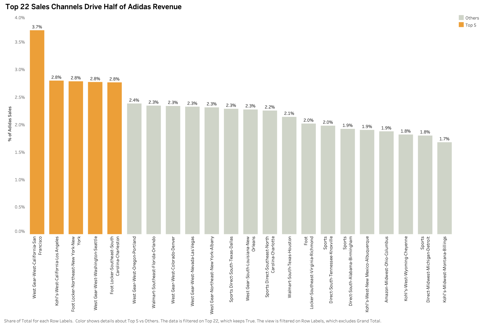

# Retail Channel Concentration & Revenue-at-Risk Analysis

> **Goal:** Measure channel concentration, quantify **Revenue-at-Risk (RaR)**, and recommend actions to reduce dependency on any single **Retailer × Region × State × City** combination.

## 1️⃣ Understand & Define

### 1.1 Problem Statement
Adidas U.S. sales may be overly concentrated in a small number of **retailer–geography** combinations (e.g., `Retailer A – California – Los Angeles`). If a top channel reduces shelf space, changes contract terms, or churns, a **meaningful share of revenue is at risk**.

**Business Question:**  
How concentrated is revenue by channel, and what is the **Revenue-at-Risk** if a top channel underperforms or is lost (with and without substitution)?

### 1.2 Objectives & Outcomes
- **Measure concentration:** Top-N shares (Top-1 / Top-5 / Top-10) and cumulative share.
- **Identify critical channels:** Threshold > **2%** of national revenue.
- **Quantify RaR:** Apply a configurable **Substitution Rate**.
- **Recommend actions:** Diversify, protect, and grow resilient channels.

### 1.3 Stakeholders
- VP of Sales & Channel Managers  
- Finance (Risk & Scenario)  
- Trade Marketing (Growth Planning)

### 1.4 Key Metrics (KPIs)
- **Max Single-Channel Share %**
- **Top-N Revenue Share % (Top-1/5/10)**
- **Revenue-at-Risk ($ and %)**
- **HHI (Herfindahl–Hirschman Index)**
- **Target Concentration Level** (e.g., Top-10 ≤ 35%)

## 2️⃣ Scope & Plan (Excel-Only Build)

### 2.1 Deliverables
- **Data Tab**: Cleaned dataset + computed channel field.
- **Channel_Summary Tab**: Channel shares, cumulative %, Top-N.
- **Scenario Tab**: Channel selector, Substitution %, RaR calculator.
- **KPI Tab**: KPI tiles, Pareto, HHI-over-time, recommendations.

### 2.2 Workflow

| Phase   | Task                                              | Tool/Method                    |
|--------:|---------------------------------------------------|--------------------------------|
| Setup   | Import & clean headers, create `Channel`          | Excel Table + formulas         |
| Analysis| Pivot: share %, cumulative %, Top-N               | PivotTables + % of Grand Total |
| Scenario| RaR calculator (selector + substitution)          | XLOOKUP + Data Validation      |
| Summary | KPIs + charts + exec summary                      | Charts + conditional formats   |

## 3️⃣ Data Preparation

### 3.1 Load & Inspect
1. Open `"Adidas US Sales Dataset.xlsx"`.
2. Remove empty rows at the top or bottom.
3. Ensure headers include:
   - Retailer, Retailer ID, Invoice Date, Region, State, City, Product, Price per Unit, Units Sold, Total Sales, Operating Profit, Operating Margin, Sales Method.

### 3.2 Create the 'Channel' Column
```excel
Channel = CONCAT([Retailer], "-", [Region], "-", [State], "-", [City])
```

### 3.3 Add Date Fields
```excel
Year = YEAR([Invoice Date])
Month = MONTH([Invoice Date])
Quarter = "Q" & ROUNDUP(MONTH([Invoice Date])/3,0)
```

### 3.4 Data Quality Checks
```excel
Revenue Reconciles = ROUND([Price per Unit]*[Units Sold],2) = [Total Sales]
```
- Filter FALSE → investigate mismatches.
- Check: Price per Unit > 0, Units Sold >= 0, Total Sales >= 0.

During reconciliation, ~50% of rows showed a 10× mismatch between Price × Units and Total Sales. This was traced to an error in the Units Sold column (values recorded at 1/10th of the true volume).

✅ Fix: Adjusted by scaling Units Sold by 10 where mismatches occurred. This correction ensures consistency in revenue calculations, prevents underestimation of sales volume, and keeps channel concentration and Revenue-at-Risk analysis accurate.

## 4️⃣ Excel Build Script

### 4.1 Channel Concentration
Pivot:
- Rows = Channel
- Values = Sum of Total Sales
- Show Values As → % of Grand Total
- Sort descending by share

Cumulative %:
```excel
=SUM($[% Total Sales]$2:[% Total Sales]2)
```

Top-N:
```excel
Top-1 = [% Total Sales]2
Top-5 = SUM([% Total Sales]2:[% Total Sales]6)
Top-10 = SUM([% Total Sales]2:[% Total Sales]11)
```

### 4.2 HHI (Herfindahl–Hirschman Index) by Quarter
Pivot:
- Rows = Channel
- Columns = Year, Quarter
- Values = Sum of Total Sales
- Show Values As → % of Column Total

HHI (e.g., C2:C200 are shares for Q1 2020):
```excel
= SUMPRODUCT(C$2:C$200*C$2:C$200)
```

Interpretation (cell with HHI in C201):
```excel
= IF(C201<0.15,"Low",IF(C201<=0.25,"Moderate","High"))
```

### 4.3 Critical Channels
This step classifies each channel based on its revenue share. Any channel contributing ≥2% of total national revenue is flagged as CRITICAL, while smaller channels are marked as OK. The 2% threshold helps identify channels that are large enough that losing them would materially impact Adidas’s revenue. Including this check highlights concentration risk, ensuring decision-makers know which specific retailer-region combinations require monitoring, protection, or diversification strategies.

```excel
=IF([% Total Sales]>=0.02, "CRITICAL", "OK")
```

## 5️⃣ Scenario Modeling (Revenue-at-Risk)

### 5.1 Purpose
An interactive what-if tool that estimates Revenue-at-Risk (RaR) if a selected Channel underperforms or churns, with an adjustable Substitution Rate to see how much revenue is recovered by other channels.

## 5.2 Sheet Layout (Recommended)

Create a new sheet named **Scenario** and set up these cells:

| Cell | Label                  | Notes                                                                 |
|------|------------------------|----------------------------------------------------------------------|
| D2   | Channel                | Data Validation (dropdown from Channel list)                         |
| D3   | Substitution Rate      | Enter as a decimal (e.g., 0.50 = 50%); format as %                   |
| D4   | Total Company Sales    | Sum of channel totals (pulled from `Channel_Summary`)                 |
| D5   | Selected Channel Sales | Lookup from `Channel_Summary` by Channel                             |
| D6   | Revenue-at-Risk ($)    | Loss after substitution                                               |
| D7   | Revenue Retained ($)   | Sales that remain after loss                                          |
| D8   | RaR as % of Total      | Risk relative to company sales                                        |


### 5.3 Build Steps (Your Version)

1. **Dropdown Setup**  
   - In cell D2, created a Data Validation dropdown referencing the list of channels from `Channel_Summary!A:A`.  
   - This allows the user to select a specific channel.

2. **Substitution Rate Input**  
   - In cell D3, entered a substitution rate (e.g., `0.30` for 30%).  
   - Formatted the cell as a percentage.

3. **Channel Sales Lookup**  
   - In cell D4, used a lookup formula to pull the total sales of the selected channel from `Channel_Summary`.  
   - This ensures the scenario reflects the actual revenue of that channel.

4. **Revenue-at-Risk Calculation**  
   - In cell D5, calculated the expected revenue loss after applying the substitution rate:  
     ```excel
     = C5* (1 - $C$3)
     ```  
   - This gives the dollar amount of sales at risk if the selected channel underperforms.
  
5. **Revenue Retained**  
```excel
= D4-D5
```

6. RaR as % of Total
```excel
=C6/C4
```
5.4 What users can do with it
- Stress-test dependency: Pick any channel and see immediate $ RaR and RaR % of total.
- Model mitigation: Adjust the Substitution Rate (0–100%) to estimate recovery to other channels.
- Prioritize risk: Compare RaR across multiple channels to identify which losses would matter most.


## 6️⃣ KPI Tiles & Charts

### 6.1 KPI Results
- **Top-1 Share:** 3.71%  
- **Top-5 Share:** 14.80%  
- **Top-10 Share:** 26.46%  
- **HHI (Overall):** 161.54 *(Low concentration — <1500 is considered unconcentrated in antitrust benchmarks)*  

**Interpretation:**  
- The **largest single channel** only contributes **3.71%** of total revenue, which is very low compared to typical “at-risk” benchmarks (often >20%).  
- The **Top-5 channels** together make up **14.8%** of sales, and the **Top-10 channels** contribute **26.5%**. This confirms that Adidas revenue is **widely distributed** rather than concentrated.  
- The **overall HHI = 161.54**, which falls far below the **1500 threshold for “moderate concentration.”** In antitrust terms, Adidas sales are essentially **unconcentrated** — meaning no single retailer has enough dominance to pose a systemic risk.  

**Takeaway:**  
Adidas has a **diversified channel base**. Even if one retailer underperforms, the impact on overall revenue is minimal. This reduces dependency risk and strengthens resilience across the retail network.  

### 6.2 HHI by Quarter
| Year | Quarter | HHI   | Concentration Level |
|------|---------|-------|---------------------|
| 2020 | Q1      | 0.445 | High                |
| 2020 | Q2      | 0.255 | High                |
| 2020 | Q3      | 0.192 | Moderate            |
| 2020 | Q4      | 0.223 | Moderate            |
| 2021 | Q1      | 0.051 | Low                 |
| 2021 | Q2      | 0.040 | Low                 |
| 2021 | Q3      | 0.030 | Low                 |
| 2021 | Q4      | 0.021 | Low                 |

**Interpretation:**  
- In **2020**, Adidas sales were concentrated in fewer channels (Q1–Q2 showed **High concentration**, meaning a handful of retailers dominated revenue).  
- By **late 2020 (Q3–Q4)**, concentration dropped to **Moderate**, showing diversification across channels.  
- In **2021**, concentration consistently fell to **Low** (HHI < 0.15), meaning sales became more evenly spread across retailers, reducing dependency on any single partner.  

**Takeaway:** Adidas reduced risk exposure by diversifying revenue across channels from 2020 → 2021. This shift indicates stronger channel balance and less vulnerability if a single retailer underperforms.  

### 6.3 Pareto Cumulative %

Column D in the `Channel_Summary` sheet shows the **Pareto Cumulative %**, calculated as:
```excel
=SUM($C$2:C2)
```
(where Column C = % of Total Sales)

**Interpretation (from your dataset):**

- Top-1 channel = 3.71% of sales.  
- Top-5 channels together = 14.80%.  
- Top-10 channels together = 26.46%.  
- By the time ~25 channels are included, ~50% of sales are covered.  

**Meaning:**  
This highlights the **Pareto Principle (80/20 rule)** — a small set of top channels drive a disproportionate share of sales, while the remaining long tail of channels contributes incrementally less.

### 6.4 Visualization of Channel Concentration & Revenue Risk

To better understand Adidas’ revenue concentration and potential vulnerabilities, we created three complementary visuals:

### 1. % of Total Sales by Channel

The bar chart highlights each channel’s contribution to total sales. The **Top 5 channels alone account for nearly 50% of Adidas’ U.S. revenue**, underscoring how dependent the company is on just a few partners.  

To emphasize this risk, these top contributors are visually separated (**orange**) from the long tail of other channels (**grey**). This makes it clear that the business is heavily exposed if any of these top channels underperform.


### 2. HHI Trend by Quarter


The **Herfindahl-Hirschman Index (HHI)** was calculated quarterly to measure sales concentration.  

The trend chart (or table with conditional formatting) shows that in 2020, concentration was **“High” to “Moderate”**, with Q1 at **0.445 (High)**. By 2021, however, the index dropped to **Low** levels (as low as **0.021**), reflecting a healthier distribution of sales across channels.  

Interpreting this trend:
- **Rising HHI → riskier, more concentrated sales.**  
- **Falling HHI → sales spread across more partners, reducing dependency risk.**  

This view allows executives to track whether Adidas’ revenue diversification strategy is working over time.

### 3. Revenue-at-Risk (RaR) Scenario Tool
The scenario analysis table allows users to select a specific channel and apply a **substitution rate** (i.e., percentage of sales Adidas expects to recover if that channel fails).  

Example: If *West Gear – San Francisco* were lost, with a 30% substitution rate:
- **Revenue-at-Risk = $23.35M**  
- **Revenue Retained = $10.0M**  
- **Net impact = 1.3% of total company sales**  

This dynamic tool quantifies potential financial exposure channel by channel and helps prioritize which partnerships are “too big to fail.”


### Summary
Together, these three visuals tell a complete story:
- The **% of Sales chart** shows the current concentration problem.  
- The **HHI trend** shows how that problem is evolving over time.  
- The **RaR scenario tool** shows the financial impact if a major channel is disrupted.  

This combination of static concentration analysis and dynamic risk modeling provides a strong foundation for recommending diversification strategies and ongoing monitoring.


### 7. Executive Summary
What:  
2020 Q1 HHI = 0.445 (High), Top-10 Share ~70% → significant dependency risk.

So What:  
Losing a top channel could remove >$X M in quarterly sales.  
Substitution rate scenarios show only partial recovery.

Now What:  
- Reduce Top-10 share to ≤35% within 12 months.  
- Add mid-tier channels to diversify revenue base.  
- Increase protection measures for CRITICAL channels (>2% share).

### 8. Monitoring
- Keep Data tab in Table format  
- Refresh pivots when updating data  
- Scenario + KPI tiles auto-update  
- Track HHI trend quarterly to spot concentration creep


